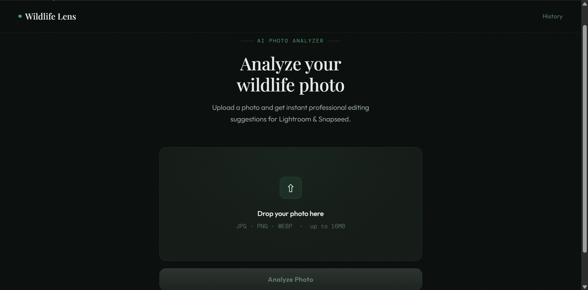
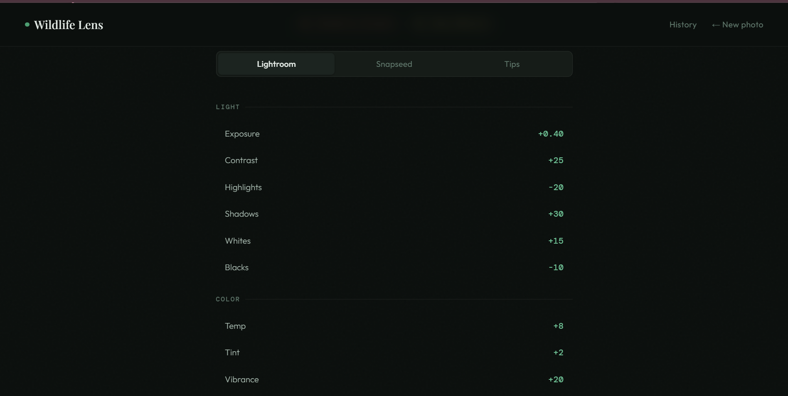

# Wildlife Lens — AI Wildlife Photo Analyzer

A clean, professional web app that analyzes wildlife photos and generates instant editing suggestions for **Lightroom** and **Snapseed**, powered by Google Gemini AI.


**🌿 Live Demo → [image-analyzer-1-8u5g.onrender.com](https://image-analyzer-2.onrender.com/)**

---

## Screenshots




---

## Features

- Upload any wildlife photo (JPG, PNG, WEBP — up to 16MB)
- AI-powered brightness & sharpness analysis using OpenCV
- Full Lightroom editing settings (Light, Color, Effects, Detail, Color Grading)
- Full Snapseed editing settings (Tune Image, Details, Curves, HDR, and more)
- 7 beginner tips tailored to the specific photo
- Clean dark UI with professional typography

---

## Tech Stack

- **Backend** — Python, Flask, Gunicorn
- **AI** — Google Gemini 2.5 Flash (via `google-generativeai`)
- **Image Analysis** — OpenCV, NumPy
- **Frontend** — HTML, CSS, Vanilla JS
- **Fonts** — Playfair Display, DM Mono, Outfit
- **Deployed on** — Render

---

## Getting Started

### 1. Clone the repository
```bash
git clone https://github.com/abhii-navv/Image-analyzer.git
cd Image-analyzer
```

### 2. Create a virtual environment
```bash
python -m venv venv

# Windows
venv\Scripts\activate

# Mac/Linux
source venv/bin/activate
```

### 3. Install dependencies
```bash
pip install -r requirements.txt
```

### 4. Set up environment variables
Create a `.env` file in the project root:
```
GEMINI_API_KEY=your_gemini_api_key_here
```
Get your API key from [Google AI Studio](https://aistudio.google.com).

### 5. Run the app
```bash
python app.py
```

Open your browser at `http://127.0.0.1:5000`

---

## Project Structure

```
ai_wildlife_analyzer/
├── app.py                   # Flask app & routes
├── requirements.txt         # Python dependencies
├── Procfile                 # Deployment config
├── services/
│   ├── image_analysis.py    # OpenCV brightness & blur analysis
│   └── suggestion_engine.py # Gemini AI integration & parser
├── templates/
│   ├── index.html           # Upload page
│   ├── results.html         # Results page
│   └── error.html           # Error page
├── static/
│   ├── css/style.css        # All styles
│   ├── js/script.js         # Drag & drop, form handling
│   └── uploads/             # Uploaded photos (auto-created, not tracked)
└── images/                  # App screenshots for README
```

---

## Environment Variables

| Variable | Description |
|---|---|
| `GEMINI_API_KEY` | Your Google Gemini API key |

> Never commit your `.env` file. It is listed in `.gitignore`.

---

© 2025 Abhi. All rights reserved.
